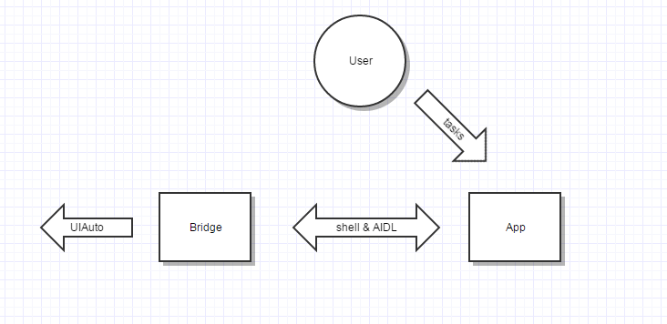

# Tasker
Running tasks based on any uiautomator API through this APP on Root devices

## Functional design

There are 2 parts to implement this goal:
1. Tasker-App, accept user tasks and route these commands to run test suit app.
2. Bridge, based on android junit test and uiautomator framework Instrumention decleared:
```
<instrumentation
        android:name="android.support.test.runner.AndroidJUnitRunner"
        android:functionalTest="false"
        android:handleProfiling="false"
        android:label="Tests for dev.tornaco.tasker"
        android:targetPackage="dev.tornaco.tasker" />
```
On a normal test step, we usually start a test like this:
```
am instrument -w -r -e package xxx -e debug false xxxx/android.support.test.runner.AndroidJUnitRunner
```

So, we execute this command on our app, then the test suit can get the tasks(param, data) via AIDL service.

## Flow





### Code example

We can easily achive this goal: Launcher an app and find an UI object and perform a lot of actions.

1. AIDL call the Tasker App to retrieve the params etc.
```java
TaskerBridgeServiceProxy.version(InstrumentationRegistry.getTargetContext(),
                new Consumer<String>() {
                    @Override
                    public void accept(@Nullable String s) {
                        Logger.d("TaskerBridgeService version: %s", s);
                    }
                });
 ```
2. Get the UIDevice.
```java
 UiDevice uiDevice = UiDevice.getInstance(InstrumentationRegistry.getInstrumentation());
 Logger.d("UIDevice: %s", uiDevice);
```

3. Use the API of UIDevice.
```java
uiDevice.pressHome();
 // Launch contacts app.
String kill = uiDevice.executeShellCommand("am force-stop com.android.contacts");
String res = uiDevice.executeShellCommand("am start -n com.android.contacts/.activities.PeopleActivity");

UiObject addButton = uiDevice.findObject(
     new UiSelector().resourceId("com.android.contacts:id/floating_action_button"));

addButton.clickAndWaitForNewWindow();

sleep(10 * 1000);
```

------------------
